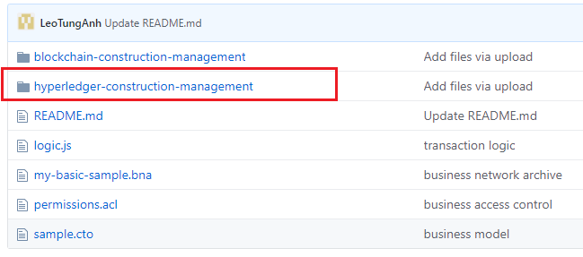
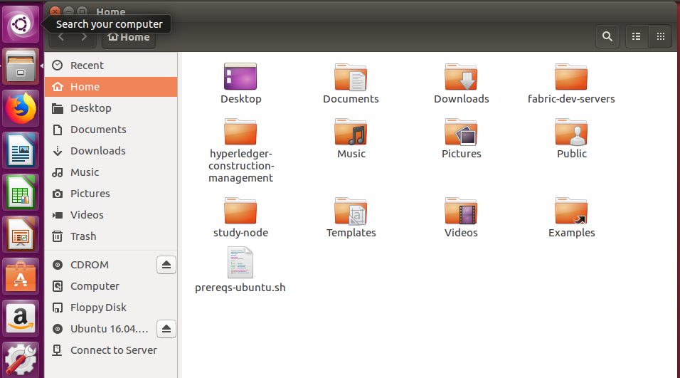
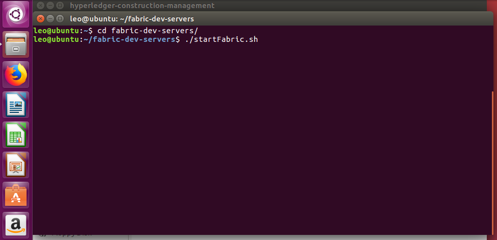
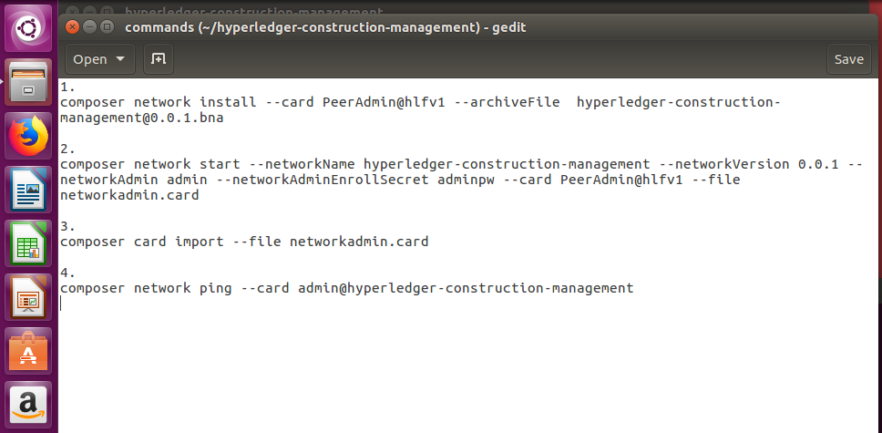
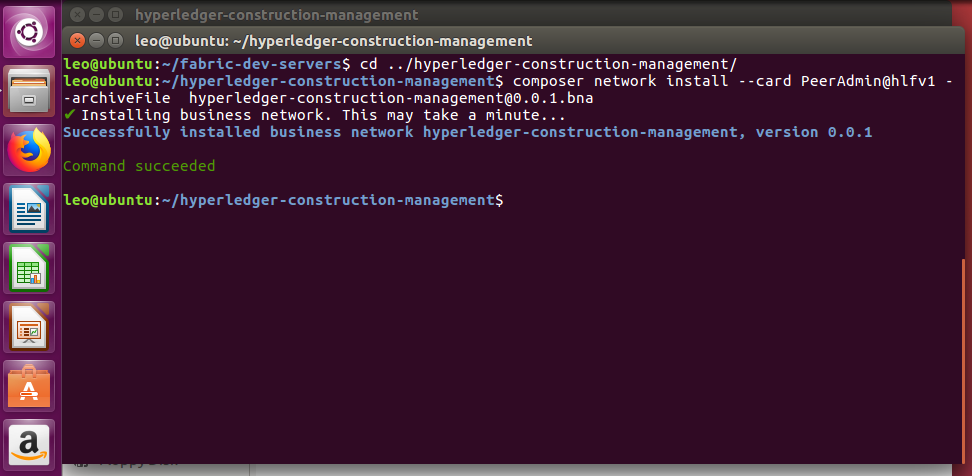
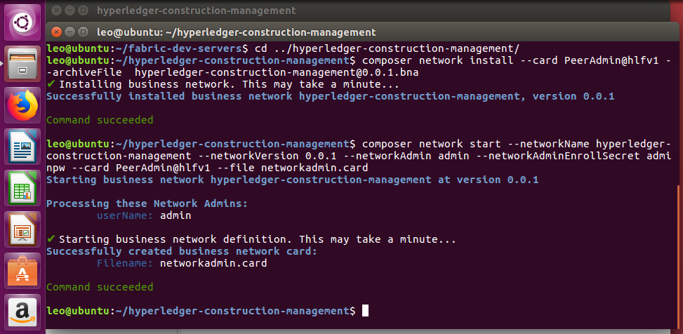
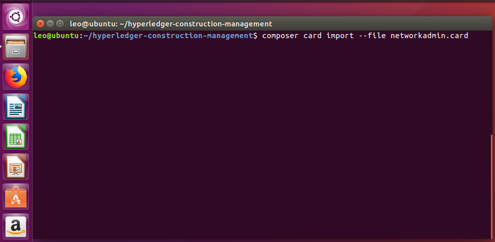
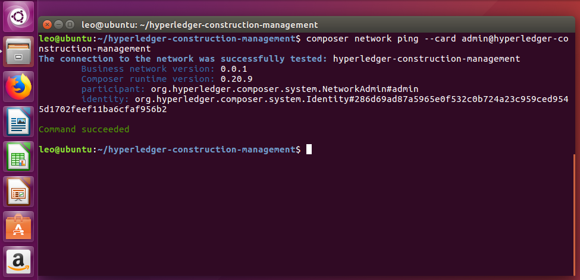
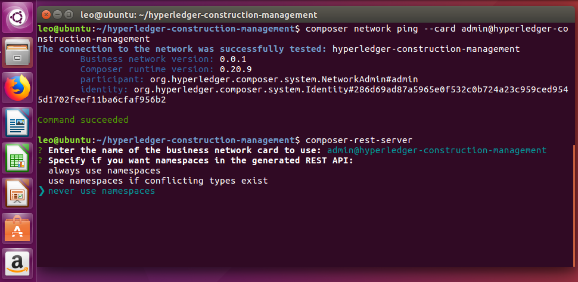
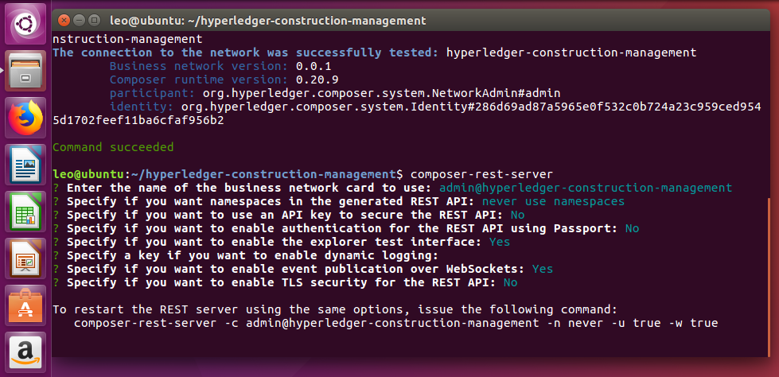

# HyperledgerComposerConstructionManagement

## Installing pre-requisites:

### *If installing Hyperledger Composer using Linux, be aware of the following advice:
- Login as a normal user, rather than root.
- Do not su to root.
- When installing prerequisites, use curl, then unzip using sudo.
- Run prereqs-ubuntu.sh as a normal user. It may prompt for root password as some of it's actions are required to be run as root.
- Do not use npm with sudo or su to root to use it.
- Avoid installing node globally as root.

### I. To install pre-requisites you should use following commands:

curl -O https://hyperledger.github.io/composer/v0.19/prereqs-ubuntu.sh

chmod u+x prereqs-ubuntu.sh

./prereqs-ubuntu.sh

### II. Install components

#### Step 1: Install the CLI tools 

#### * Note that you should not use su or sudo for the following npm commands.

##### 1. Essential CLI tools:

npm install -g composer-cli@0.19

##### 2. Utility for running a REST Server on your machine to expose your business networks as RESTful APIs:

npm install -g composer-rest-server@0.19

##### 3. Useful utility for generating application assets:

npm install -g generator-hyperledger-composer@0.19

##### 4. Yeoman is a tool for generating applications, which utilises generator-hyperledger-composer:

npm install -g yo

#### Step 2: Install Playground

npm install -g composer-playground@0.19

#### Step 3: Set up your IDE

Whilst the browser app can be used to work on your Business Network code, most users will prefer to work in an IDE. Our favourite is VSCode, because a Composer extension is available.

Install VSCode from this URL: https://code.visualstudio.com/download

Open VSCode, go to Extensions, then search for and install the Hyperledger Composer extension from the Marketplace.

#### Step 4: Install Hyperledger Fabric

##### 1. This step gives you a local Hyperledger Fabric runtime to deploy your business networks to. In a directory of your choice (we will assume ~/fabric-dev-servers), get the .tar.gz file that contains the tools to install Hyperledger Fabric:

mkdir ~/fabric-dev-servers && cd ~/fabric-dev-servers

curl -O https://raw.githubusercontent.com/hyperledger/composer-tools/master/packages/fabric-dev-servers/fabric-dev-servers.tar.gz
tar -xvf fabric-dev-servers.tar.gz

*A zip is also available if you prefer: just replace the .tar.gz file with fabric-dev-servers.zip and the tar -xvf command with a unzip command in the preceding snippet.

##### 2. Use the scripts you just downloaded and extracted to download a local Hyperledger Fabric v1.1 runtime:

cd ~/fabric-dev-servers
export FABRIC_VERSION=hlfv11
./downloadFabric.sh

### III. Controlling your dev environment

The first time you start up a new runtime, you'll need to run the start script, then generate a PeerAdmin card:

cd ~/fabric-dev-servers

export FABRIC_VERSION=hlfv11

./startFabric.sh

./createPeerAdminCard.sh

## Install Node Express for web development

### I. Install node
The easiest way to install the most recent LTS version of Node 10.x is to use the package manager to get it from the Ubuntu binary distributions repository. This can be done very simply by running the following two commands on your terminal:

curl -sL https://deb.nodesource.com/setup_10.x | sudo -E bash - 

sudo apt-get install -y nodejs

- Warning: Don't install directly from the normal Ubuntu repositories because they contain very old versions of node.

### II. Testing your Nodejs and NPM installation

node -v

v10.16.0 (this line depends on your version)

npm -v

6.9.0 (this line depends on your version)

### III. Install development dependencies

npm install eslint --save-dev

## Run project

### I. Download hyperledger-construction-management file from github to your local machine:

#### 1. Download from github:

#### 2. put downloaded file in your home directory in your local machine:

#### 3. go to the Fabric server development to bring up hyperledger fabric:

cd fabric-dev-servers

./startFabric.sh

#### 4. go to the hyperledger-construction-management file and type following commands for bringing up hyperledger composer. All commands could be found in the /hyperledger-construction-management/commands

##### 1. install business network

##### 2. start business network

#### 3. import card for using composer

#### 4. test imported card by using ping

#### 5. start rest composer server. 

In the /hyperledger-construction-management directory use following command to start hyperledger composer server:

composer-rest-server

Choose options for composer based on information in the following image:

admin card: admin@hyperledger-construction-management

